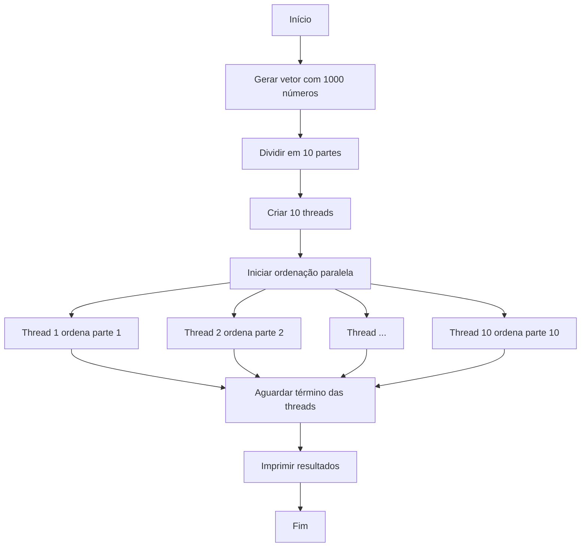

# 🧵 Ordenação Paralela com Threads em Java ⚡️

## Etapas do Processo

1. **Geração de números aleatórios**

Cria um vetor de 1000 números inteiros positivos entre 1 e 10000.

2. **Divisão do vetor em partes iguais**

Divide o vetor em 10 partes de 100 elementos cada.

3. **Criação e inicialização de threads**

Cria 10 threads, cada uma responsável por ordenar uma parte do vetor.

4. **Ordenação paralela com `Arrays.sort()`**

Cada thread ordena sua parte de forma independente usando o método `Arrays.sort()`.

5. **Sincronização com `join()`**

O programa principal aguarda a conclusão de todas as threads antes de prosseguir.

6. **Impressão dos resultados formatados**

Exibe o vetor completo e as partes ordenadas individualmente.

## Fluxo de Execução


## Estrutura do Projeto

```

ordenacao-paralela-threads-java/

├── TarefaOrdenacao.java    # Lógica de ordenação

├── GerenciadorArray.java   # Manipulação de dados

├── Main.java               # Ponto de entrada

├── README.md               # Documentação

└── .gitignore              # Configuração Git

```

## Execução do Projeto

### Pré-requisitos

- Java JDK 17+

- Terminal/Command Prompt

### Comandos:

```bash

# Clonar repositório

git clone https://github.com/seu-usuario/ordenacao-paralela-threads-java.git

# Acessar diretório

cd ordenacao-paralela-threads-java

# Compilar

javac *.java

# Executar

java Main

```

## Saída do Programa

```

Thread 1: Ordenação iniciada

Thread 2: Ordenação iniciada

...

Thread 10: Ordenação concluída

VETOR COMPLETO:

[parte1] [parte2] ... [parte10]

PARTES ORDENADAS:

Parte 1:

3   8  15  22  30  37  45  52  60  67

75  82  89  97 105 112 120 127 135 142

...

Parte 2:

102 115 129 142 156 169 183 196 210 223

237 250 264 277 291 304 318 331 345 358

...

```

## Relevância Técnica

- **Aplicação prática de programação concorrente**

Demonstra como utilizar threads para processamento paralelo.

- **Demonstração de ganhos de desempenho**

Comparação entre a execução serial e paralela.

- **Padrão de divisão de tarefas**

Divide um problema grande em partes menores para processamento simultâneo.

- **Base para sistemas distribuídos**

Pode ser estendido para sistemas distribuídos.

- **Exemplo educativo para aprendizado de threads**

Ideal para estudantes e profissionais aprenderem sobre concorrência.

### Casos de uso:

- Processamento de grandes datasets

- Sistemas de análise de dados

- Aplicações de big data

- Algoritmos de machine learning

## Melhorias Futuras

1. **Benchmark de desempenho**

- Comparação serial vs paralelo

- Métricas de tempo de execução

2. **Interface gráfica**

- Visualização do processo

- Controles interativos

3. **Escalabilidade dinâmica**

- Configuração de tamanho do vetor

- Ajuste automático de threads

4. **Novos algoritmos**

- Implementação de quicksort/mergesort

- Comparação de eficiência

5. **Exportação de resultados**

- Geração de relatórios em CSV

- Gráficos comparativos

## Tecnologias Utilizadas

| Tecnologia          | Uso                              | Versão |

|---------------------|----------------------------------|--------|

| Java                | Linguagem principal             | 17+    |

| Runnable            | Interface para threads          | -      |

| Arrays.sort()       | Algoritmo de ordenação          | -      |

| System.arraycopy()  | Manipulação eficiente de arrays | -      |

## Contribuição

1. **Faça fork do projeto**

`git fork`

2. **Crie sua branch**

`git checkout -b feature/nova-feature`

3. **Commit suas alterações**

`git commit -m 'Add feature'`

4. **Push para a branch**

`git push origin feature/nova-feature`

5. **Abra um Pull Request**

## Licença

Distribuído sob licença MIT. Consulte [LICENSE](LICENSE) para detalhes.

**Desenvolvedor:** [Pedro Kauan]

[](https://github.com/pkziinn10)
