# 🧵 Ordenação Paralela com Threads em Java ⚡️

[](https://www.oracle.com/java/)

[](https://opensource.org/licenses/MIT)

[](https://github.com/pkziinn10/ordenacao-paralela-threads-java)

> **Projeto de demonstração de programação concorrente em Java para ordenação paralela de dados**

Este projeto ilustra a aplicação prática de threads em Java para ordenar partes de um vetor simultaneamente. Através do processamento paralelo, o sistema demonstra ganhos de eficiência na ordenação de grandes conjuntos de dados.

## 📋 Índice

- [Etapas do Processo](#-etapas-do-processo)

- [Fluxo de Execução](#-fluxo-de-execução)

- [Estrutura do Projeto](#-estrutura-do-projeto)

- [Execução do Projeto](#-execução-do-projeto)

- [Saída do Programa](#-saída-do-programa)

- [Relevância Técnica](#-relevância-técnica)

- [Melhorias Futuras](#-melhorias-futuras)

- [Tecnologias Utilizadas](#-tecnologias-utilizadas)

- [Contribuição](#-contribuição)

- [Licença](#-licença)

---

## 🔄 Etapas do Processo

1. **Geração de números aleatórios**

Cria um vetor de 1000 números inteiros positivos entre 1 e 10000.

2. **Divisão do vetor em partes iguais**

Divide o vetor em 10 partes de 100 elementos cada.

3. **Criação e inicialização de threads**

Instancia 10 threads, cada uma responsável por ordenar uma parte do vetor.

4. **Ordenação paralela com `Arrays.sort()`**

Cada thread ordena sua parte de forma independente usando o método `Arrays.sort()`.

5. **Sincronização com `join()`**

O programa principal aguarda a conclusão de todas as threads antes de prosseguir.

6. **Impressão dos resultados formatados**

Exibe o vetor completo e as partes ordenadas individualmente.

---

## 📊 Fluxo de Execução

```mermaid

graph TD

A[Início] --> B[Gerar vetor com 1000 números]

B --> C[Dividir em 10 partes]

C --> D[Criar 10 threads]

D --> E[Iniciar ordenação paralela]

E --> F[Thread 1 ordena parte 1]

E --> G[Thread 2 ordena parte 2]

E --> H[Thread ...]

E --> I[Thread 10 ordena parte 10]

F --> J[Aguardar término das threads]

G --> J

H --> J

I --> J

J --> K[Imprimir resultados]

K --> L[Fim]

```



---

## 📂 Estrutura do Projeto

```

ordenacao-paralela-threads-java/

├── TarefaOrdenacao.java    # Implementa Runnable para ordenação de partes

├── GerenciadorArray.java   # Gerencia geração, divisão e impressão do array

├── Main.java               # Coordena threads e fluxo principal

├── README.md               # Documentação do projeto

└── .gitignore              # Arquivos ignorados pelo Git

```

---

## 🚀 Execução do Projeto

### Pré-requisitos

- Java JDK 17+

- Git (opcional)

### Passos:

```bash

# Clone o repositório

git clone https://github.com/pkziinn10/ordenacao-paralela-threads-java.git

# Acesse o diretório

cd ordenacao-paralela-threads-java

# Compile os arquivos

javac *.java

# Execute o programa

java Main

```

---

## 💻 Saída do Programa

```

Thread 1: Ordenação iniciada

Thread 2: Ordenação iniciada

...

Thread 10: Ordenação concluída

VETOR COMPLETO:

[parte1] [parte2] ... [parte10]

PARTES ORDENADAS:

Parte 1:

3   8  15  22  30  37  45  52  60  67

75  82  89  97 105 112 120 127 135 142

...

Parte 2:

102 115 129 142 156 169 183 196 210 223

237 250 264 277 291 304 318 331 345 358

...

```

---

## 🧠 Relevância Técnica

- **Aplicação prática de programação concorrente**

Demonstra como utilizar threads para processamento paralelo.

- **Demonstração de ganhos de desempenho**

Comparação entre a execução serial e paralela.

- **Padrão de divisão de tarefas**

Divide um problema grande em partes menores para processamento simultâneo.

- **Base para sistemas distribuídos**

Pode ser estendido para sistemas distribuídos.

- **Exemplo educativo para aprendizado de threads**

Ideal para estudantes e profissionais aprenderem sobre concorrência.

### Casos de uso:

- Processamento de grandes datasets

- Sistemas de análise de dados

- Aplicações de big data

- Algoritmos de machine learning

---

## 🔮 Melhorias Futuras

1. **Benchmark de desempenho**

- Comparação serial vs paralelo

- Métricas de tempo de execução

2. **Interface gráfica**

- Visualização do processo

- Controles interativos

3. **Escalabilidade dinâmica**

- Configuração de tamanho do vetor

- Ajuste automático de threads

4. **Novos algoritmos**

- Implementação de quicksort/mergesort

- Comparação de eficiência

5. **Exportação de resultados**

- Geração de relatórios em CSV

- Gráficos comparativos

---

## 🛠 Tecnologias Utilizadas

| Tecnologia          | Uso                              |

|---------------------|----------------------------------|

|  | Linguagem principal |

|  | Processamento paralelo |

| `Arrays.sort()`     | Algoritmo de ordenação eficiente |

| `System.arraycopy()`| Manipulação otimizada de arrays  |

---

## 👥 Contribuição

Contribuições são bem-vindas! Siga os passos:

1. **Faça um fork** do projeto

2. **Crie uma branch** para sua feature (`git checkout -b feature/incrivel`)

3. **Commit suas mudanças** (`git commit -m 'Adiciona feature incrível'`)

4. **Push para a branch** (`git push origin feature/incrivel`)

5. **Abra um Pull Request**

---

## 📜 Licença

Distribuído sob a licença MIT. Veja [LICENSE](LICENSE) para mais informações.

**Desenvolvedor:** Pedro Kauan

[](https://github.com/pkziinn10)

[](https://www.linkedin.com/in/pkziinn10/)

```
